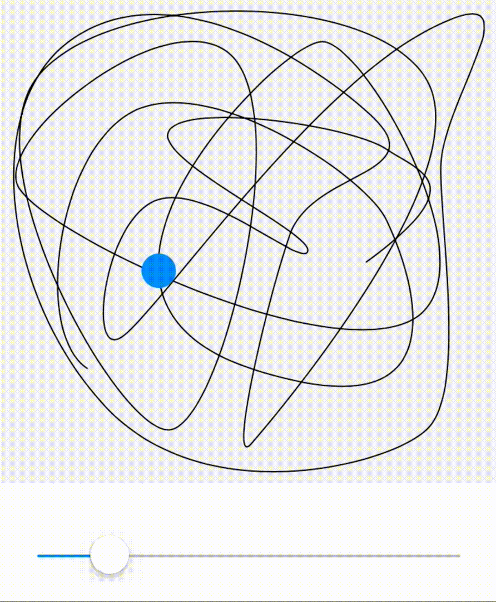
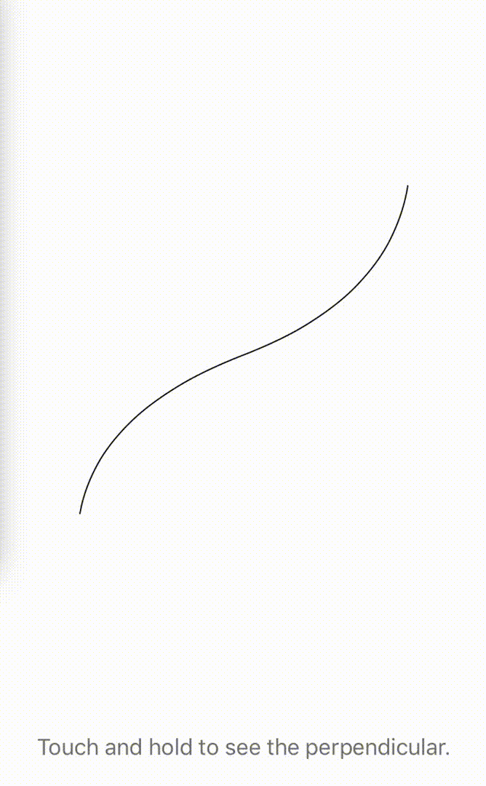
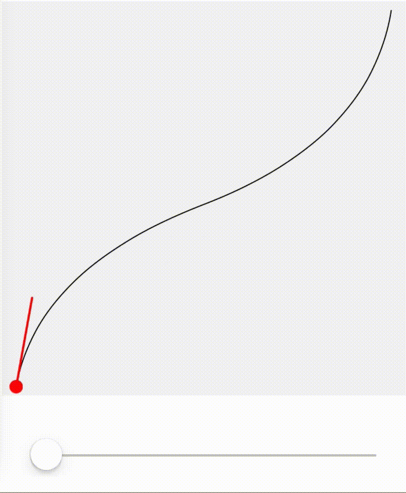

# UIBezierPath-Query

[](https://travis-ci.org/ifullgaz/UIBezierPath-Query)
[](https://cocoapods.org/pods/UIBezierPath-Query)
[](https://cocoapods.org/pods/UIBezierPath-Query)
[](https://cocoapods.org/pods/UIBezierPath-Query)

An extension to add several cool features to `UIBezierPath` and `NSBezierPath`.
<br>
Entirely based on [UIBezierPath+Superpowers](https://github.com/CodingMeSwiftly/UIBezierPath-Superpowers) by Maximilian Kraus in order to make it available to CocoaPods.
<br>
All orignal work by its original author
<br><br>

## Requirements
Tested in XCode 11.2.1 and Swift 5.1.

```
Xcode 11.2+
Swift 5.1+
```

## Installation

UIBezierPath-Query is available through [CocoaPods](https://cocoapods.org). To install
it, simply add the following line to your Podfile:

```ruby
pod 'UIBezierPath-Query'
```

## Example

To run the example project, clone the repo, and run `pod install` from the Example directory first.

## Features

This library adds several major features to `UIBezierPath`.

### Calculating path length

`var mx_length: CGFloat`

Returns the length of the path.


### Calculating bezier points

`mx_point(atFractionOfLength: CGFloat) -> CGPoint`

Returns for a given fraction the point on the path `fraction * pathLength` in to the path.




### Calculating perpendicular points and distances

`mx_perpendicularPoint(for: CGPoint) -> CGPoint`

Returns the closest point on the path to a given `CGPoint`, effectively letting fall a perpendicular on the path from `point` and returning the point of intersection.




### Calculating path slope and tangent angles

`mx_tangentAngle(atFractionOfLength: CGFloat) -> CGFloat`

For a given fraction, returns the tangent angle of the path at the point `fraction * length` in to the path.



<br>

## How it works

The backbone of it all is a function on `CGPath` called `apply(info:, function:)`. This basically lets you iterate
all elements a given `UIBezierPath` is constructed of.

#### Short aside: 
`UIBezierPath` and its Cocoa counterpart `NSBezierPath` are descriptions of bezier curves. 
These curves are basically a clever way of feeding line drawing instructions to computers. 
Bezier paths are composed of different types of path elements. Each element is either a straight line, quadratic curve or cubic
curve. At the end of the day, these curves boil down to mathematical functions which allows us to calculate things like
line lengths, tangent angles, etc.
If you are interested in more, there is a really well written and easy to understand article on [Wikipedia](https://de.wikipedia.org/wiki/Bézierkurve).


What this library does is pull out all elements a path is constructed of and throw some geometric math at them.
Since the extraction and initial computations are quite expensive, the results are cached internally if possible.

By default however, caching is disabled because - by design - the library lives in an `extension` and not a subclass of `UIBezierPath` and with that come some limitations regarding method overriding, internal vars, etc.
In order to enable the full superpower, you'll have to call `UIBezierPath.mx_prepare()`. This performs some runtime magic
under the hood which breaks the chains of `extension` and gives you full access to all features on *any* `UIBezierPath` object.

## Contributing

Feel free to build upon this project and / or submit a PR anytime.

## Authors

* *Maximilian Kraus*

## License

This project is licensed under the MIT License - see the [LICENSE.md](LICENSE.md) file for details

## Acknowledgments

* [paulwrightapps](http://www.paulwrightapps.com/blog/2014/9/4/finding-the-position-and-angle-of-points-along-a-bezier-curve-on-ios)
* [ericasadum](http://ericasadun.com/2013/03/25/calculating-bezier-points/)
